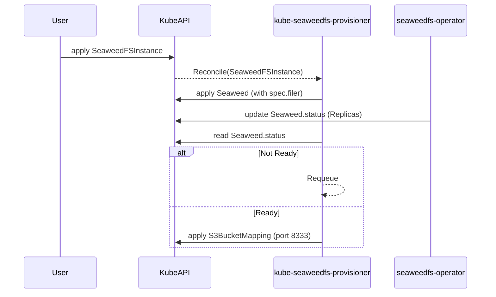

# kube-seaweedfs-provisioner


A Kubernetes operator built using `controller-runtime` to explore dynamic provisioning of SeaweedFS topologies and conditional dependency mapping.

## Motivation & Problem Statement

SeaweedFS is a highly scalable distributed file system. When deploying it on Kubernetes (via the official SeaweedFS operator), you interact with the `seaweeds.seaweedfs.com/v1` Custom Resource.

However, a critical operational gap exists when integrating SeaweedFS into broader infrastructure platforms (like automated database-as-a-service or automated backup platforms): **S3 Compatibility Readiness**.

The SeaweedFS S3 gateway is served by the **Filer** component on port `8333`. If you deploy a `Seaweed` CR *without* explicitly defining `spec.filer`, the upstream operator will spin up the Master and Volume servers, and the `Seaweed` cluster will report its `.status` as `Ready`. 

If an external automation system relies strictly on this `Ready` status to begin provisioning S3 buckets or mapping S3 credentials, it will fail silently or crash because the Filer gateway does not exist. 

This project (`kube-seaweedfs-provisioner`) was built to demonstrate a strict, automated mitigation to this problem.

## Architecture

This controller manages a higher-level CR (`SeaweedFSInstance`) which orchestrates the deployment.

### 1. Desired State Enforcement
When a `SeaweedFSInstance` is created, the reconciler generates an unstructured `Seaweed` CR. It explicitly injects the mandatory `spec.filer` constraint to guarantee that the S3 gateway will be scheduled:

```yaml
spec:
  filer: {} # Injected by the provisioner
```

### 2. External Status Observation
Instead of blindly waiting for a generic cluster ready state, the provisioner observes the upstream `Seaweed` CR's detailed status. It watches for:
`masterStatus.ReadyReplicas == masterStatus.Replicas` 

### 3. Conditional Dependency Mapping
Only after the strict readiness conditions are met will the provisioner apply the dependent `S3BucketMapping` CR. 

*(Note: `S3BucketMapping` is an intentional stand-in for OpenEverest's `BackupStorage` CR. It exists purely to test the `controller-runtime` reconciliation mechanism: external CR readiness → dependent resource creation → idempotency, without needing to import the entire OpenEverest framework).*

This guarantees that any downstream controllers handling S3 buckets will not attempt to connect to a non-existent port.



## Getting Started

### Prerequisites
- `go` version v1.21.0+
- `docker` version 17.03+.
- `kubectl` version v1.11.3+.
- A local Kubernetes cluster (e.g., `kind` or `minikube`).

### Local Development

1. **Install CRDs** into your cluster:
   ```sh
   make install
   ```

2. **Run the operator** outside the cluster (for debugging/development):
   ```sh
   make run
   ```

3. **Deploy a test instance**:
   ```sh
   kubectl apply -f config/samples/object_v1alpha1_seaweedfsinstance.yaml
   ```

## Testing Strategy

This repository employs `envtest` to validate the complex status-observation loop. Because the upstream SeaweedFS operator is not running during unit tests, the test suite simulates the upstream operator by dynamically patching the `.status.masterStatus` of the unstructured `Seaweed` CR during the reconciliation loop.

Run the test suite:
```sh
make test
```

## Project Structure

- `api/v1alpha1/`: Contains the schema definitions for `SeaweedFSInstance`.
- `internal/controller/`: The core reconciliation logic. Unstructured clients are used here to avoid hard Go dependencies on the upstream operator.
- `config/`: Kubebuilder YAML definitions for CRDs, RBAC, and Webhooks.
- `config/test-crds/`: Minimal mock CRDs for `Seaweed` and `S3BucketMapping` required by `envtest`.

## License

Copyright 2026 Aryan Bhargava.

Licensed under the Apache License, Version 2.0 (the "License");
you may not use this file except in compliance with the License.
You may obtain a copy of the License at

    http://www.apache.org/licenses/LICENSE-2.0
